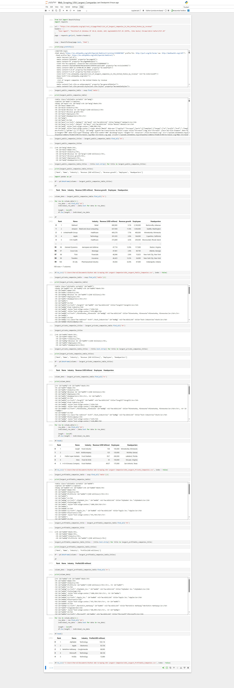

📌 Project: Web Scraping: Largest Companies by Revenue
📌 Focus: Wikipedia → Python → Clean CSV
📌 Audience: Recruiters, data analysts, fintech/back-office roles

📊 Web Scraping: Largest Companies by Revenue
📖 Project Overview

This project uses Python web scraping techniques to collect structured data on the largest companies by revenue from Wikipedia.
The scraped data is cleaned, processed, and exported into a CSV file, making it ready for further analysis or reporting.

The project demonstrates real-world data extraction, handling HTTP request issues, and transforming unstructured web data into an analysis-ready format.

🎯 Objectives

Extract company revenue data from a public web source

Handle HTTP restrictions (e.g., 403 errors) using proper request headers

Clean and organize raw scraped data

Store the final dataset in CSV format

Build a reusable data collection pipeline for analysis projects

🛠️ Tools & Technologies

Python

Requests

BeautifulSoup

Pandas

Jupyter Notebook

📊 Data Source

Wikipedia — List of largest companies by revenue

Publicly available data used for educational and analytical purposes

⚙️ Project Workflow

Send HTTP requests with a valid User-Agent

Parse HTML tables using BeautifulSoup

Extract company attributes (name, revenue, industry, etc.)

Clean missing and inconsistent values

Convert extracted data into a Pandas DataFrame

Export the cleaned dataset as a CSV file

▶️ How to Run the Project

Clone the repository:

git clone https://github.com/mahabubalam-gbs/Python-Web-Scraping-USA-Largest-Companies.git

Install required dependencies:

pip install -r requirements.txt

Run the scraper:

python scraper.py

Output:

A CSV file containing company revenue data will be generated in the project directory

🚀 Key Learnings

Practical web scraping with Python

Handling HTTP request limitations

Extracting structured data from HTML tables

Data cleaning and preprocessing

Exporting datasets for analytical workflows

👤 Author

Md Mahabub Alam
Finance Graduate | Aspiring Data Analyst
📍 Bangladesh
🔗 GitHub: https://github.com/mahabubalam-gbs

🔗 LinkedIn: https://www.linkedin.com/in/md-mahabub-alam-513611354/

## 📸 Project Screenshots

### Jupyter Notebook – Web Scraping Logic

